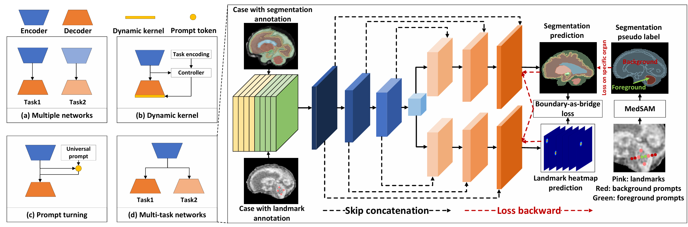
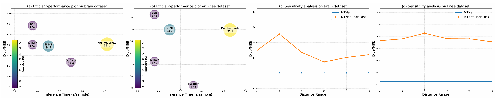

# Boundary as the Bridge: Towards Heterogeneous Partially-labeled Medical Image Segmentation and Landmark Detection
Medical landmark detection and segmentation are crucial elements for computer-aided diagnosis and treatment. However, a common challenge arises because many datasets are exclusively annotated with either landmarks or segmentation masks: a situation we term the `heterogeneous partially-labeled' problem.
To address this, we propose a novel yet effective `Boundary-as-Bridge' Loss (BaBLoss) that models the interplay between landmark detection and segmentation tasks. Specifically, our loss function is designed to maximize the correlation between the boundary distance map of the segmentation area and the heatmap deployed for landmark detection.
Moreover, we introduce a prompt pipeline to use a segment anything model and landmarks to generate pseudo-segmentation labels for data with landmark annotation. To evaluate the effectiveness of our method, we collect and build two heterogeneous partially-labeled datasets on the brain and knee. Extensive experiments on these datasets using various backbone structures have shown the effectiveness of our method.

The full information will be updated after acceptance.

## Task

A comparison of the traditional partially-labeled task (highlighted in blue) and our proposed heterogeneous partially-labeled task for the medical domain (outlined in orange). The traditional task employs a network trained on diverse partially-labeled datasets, each specifically tailored for the segmentation of a unique abdominal organ and its associated tumor. The primary objective is the comprehensive segmentation of multiple organs and tumors. Conversely, our heterogeneous task seeks to simultaneously segment organs and detect landmarks by leveraging a network trained on multiple specialized, partially labeled datasets. Each dataset, in this case, is specifically designed to segment a particular organ or its associated landmarks.

## Methods

Illustration of four approaches for partially-labeled tasks. (a) Multiple Networks: This approach involves training separate networks on a corresponding partially labeled subset. (b) Dynamic Kernel: This architecture includes an encoder, a task encoding module, a dynamic filter generation module, and a dynamic segmentation head. The kernels in the dynamic head are conditioned on the input image and the assigned task. (c) Prompt Learning: These methods craft a learnable universal prompt to depict the correlations among all tasks. This universal prompt and image features are then transformed into a task-specific prompt. (d) Multi-head Networks: This approach involves training a single network that comprises a shared encoder and task-specific decoders (heads). Each head executes a particular partially labeled segmentation or landmark detection task.

A schematic representation of our proposed BaBLoss. Subfigure (a) indicates that given a segmentation map, we determine the organ associated with the landmark based on prior knowledge. Subsequently, we generate a distance map of the segmentation boundary, where voxels closer to the boundary are assigned higher weights. Ultimately, we compute the similarity between the segmentation map and the landmark heatmap, thus integrating both representations. Subfigures (b) and (c) indicate the toy cases of the loss computation before and after convergence, respectively.

## Results

Analysis of efficiency-performance trade-off (subfigures (a) and (b)) and sensitivity (subfigures (c) and (d)). Methods closer to the upper left perform better in the two subfigures on the left. In the right two subfigures, the sensitivity analysis of the BaBLoss method is conducted by varying the hyper-parameter n in Eq. 11.

## Dataset and Pre-trained Models
The data will be made available after acceptance

The trained models are available at [Baidu Drive](https://pan.baidu.com/s/1U4ohCzTkSVv4My5mcxUrJg) with extract code: `i800`.

## More information
If you have any problem, no hesitate contact us at haifangong@outlook.com
